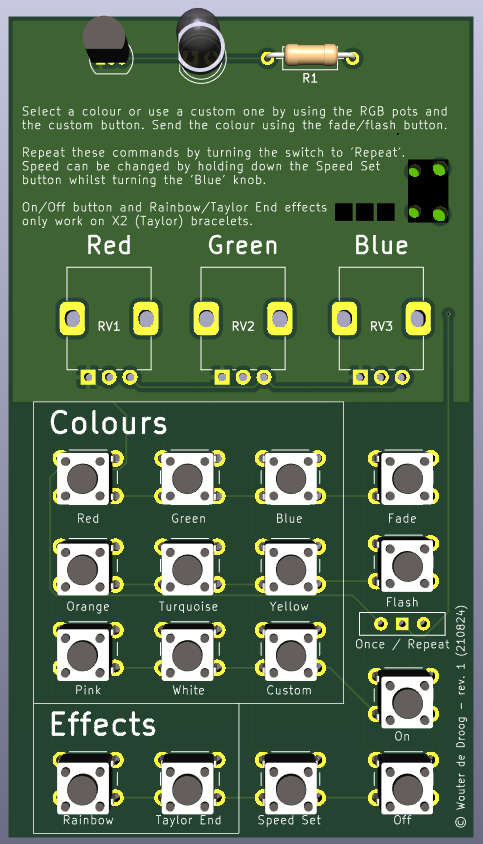

# Pixxy

Pixxy is a physical remote control for PixMob bracelets using a custom PCB, based on a Raspberry Pi Pico and
MicroPython. The PCB design is available in the [pixxy-kicad](pixxy-kicad) folder. I used KiCad 8 to design this PCB.

## Current state
I ordered an initial version of the PCB which worked perfectly. This PCB has a 4×4 button array and nine of these
buttons are used for selecting colours. The ninth button selects a custom colour, using the three potentiometers above
the buttons (RV1, RV2 and RV3). The input from these potentiometers meters will be used to generate an RGB colour.

The Fade and Flash buttons are used to send the command to the IR LED (connected to a 2N3904 transistor). The Once /
Repeat selector can be used to send the command once or continuously.

For X2 bracelets (the ones being used at Taylor Swift concerts), it is possible to set a colour indefinitely. The On and
Off buttons are used for this. The Taylor End button sends the end/go home signal used at concerts, which causes the
bracelet to loop through a set of colours until the battery runs out. The rainbow effect does the same effect, but with
all colours of the rainbow in order.

When the Speed Set button is held down, the value of the RV3 potentiometer influences the speed of the commands. This
means the potentiometer influences how long a fade or flash command lasts, and how much time is in between these
commands if the switch is in the repeat position.

## Schematic
The PCB and schematic were made using KiCad 8. The project files are available in the
[pixxy-kicad directory](pixxy-kicad). A screenshot of the schematic can be found below:

## Thanks
This project wouldn't have been possible without the research available in the
[pixmob-ir-reverse-engineering](https://github.com/danielweidman/pixmob-ir-reverse-engineering/) and 
[PixMob_IR](https://github.com/jamesw343/PixMob_IR/) repositories. The knowledge available in the
[PIXMOD Discord](https://discord.com/invite/UYqTjC7xp3) has also been super helpful.
