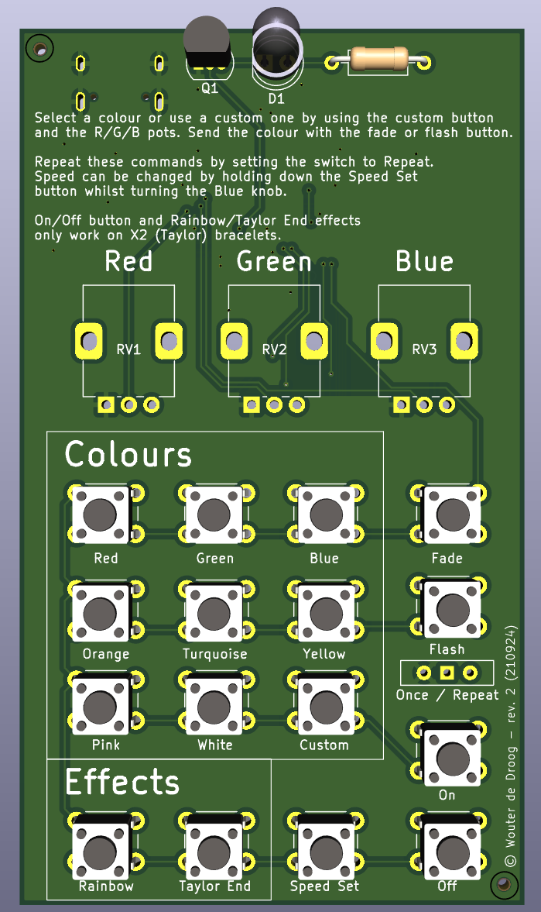
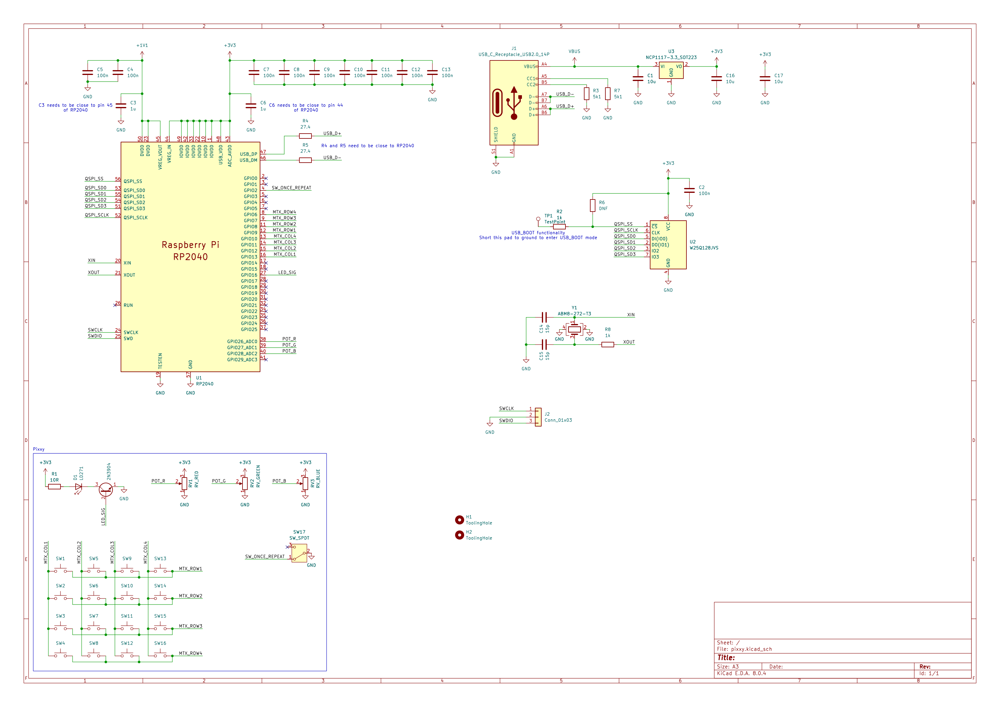

# Pixxy

Pixxy is a physical remote control for PixMob bracelets using a custom PCB. The PCB design is available in the 
[pixxy-kicad](pixxy-kicad) folder. I used KiCad 8 to design this PCB. There are currently two variations/revisions of 
this project. You're currently looking at the revision based on the RP2040 chip. 

There is also a revision based on the Raspberry Pi Pico, which is slightly cheaper and easier to assemble, but uses
micro USB instead of USB-C. This revision can be found [here](https://github.com//wouterdedroog/pixxy/tree/pico). The
MicroPython sourcecode found in the [src branch](https://github.com/wouterdedroog/pixxy/tree/src) is compatible with
both hardware versions.

## Branches
- [main](https://github.com/wouterdedroog/pixxy/tree/main) - Full project details and PCB design based on the RP2040 chip (has USB-C)
- [pico](https://github.com//wouterdedroog/pixxy/tree/pico) - PCB design based on the Raspberry Pi Pico (cheaper and easier to assemble)
- [src](https://github.com/wouterdedroog/pixxy/tree/src) - MicroPython source, compatible with both variations of Pixxy device

## Functionality
Both revisions are identical when it comes to the controls (switches and potentiometers) They both have a 4×4 button 
matrix. Eight of these buttons are used for selecting preset colours. The ninth button selects a custom colour, using 
the red/green/blue values from the potentiometers above the buttons (marked RV1, RV2 and RV3).

The Fade and Flash buttons are used to send the selected colour to the IR LED (connected to a 2N3904 transistor). The
Once / Repeat switch can be used to send the command once or multiple times.

For X2 bracelets (the ones being used at Taylor Swift concerts), it is possible to set a colour indefinitely. The On and
Off buttons are used for this. The Taylor End button sends the end/go home signal used at concerts, which causes the
bracelet to loop through a set of colours until the battery runs out. The rainbow effect does the same effect, but with
the colours of the rainbow in order.

When the Speed Set button is held down, the value of the RV3/Blue potentiometer influences the speed of the commands. 
This means the potentiometer influences how long a fade or flash command lasts, and how much time is in between these
commands if the switch is in the repeat position.

Pixxy also responds to commands over serial. You can use [this site](https://wissenhinterdenkulissen.de/armband/) which
uses WebSerial, or the Python sender scripts in the 
[pixmob-ir-reverse-engineering repo](https://github.com/danielweidman/pixmob-ir-reverse-engineering/).

## Schematic
The PCB and schematic were made using KiCad 8. The project files are available in the
[pixxy-kicad directory](pixxy-kicad). A screenshot of the schematic can be found below:

## Thanks
This project wouldn't have been possible without the research available in the
[pixmob-ir-reverse-engineering](https://github.com/danielweidman/pixmob-ir-reverse-engineering/) and 
[PixMob_IR](https://github.com/jamesw343/PixMob_IR/) repositories. The knowledge available in the
[PIXMOD Discord](https://discord.com/invite/UYqTjC7xp3) has also been super helpful.
