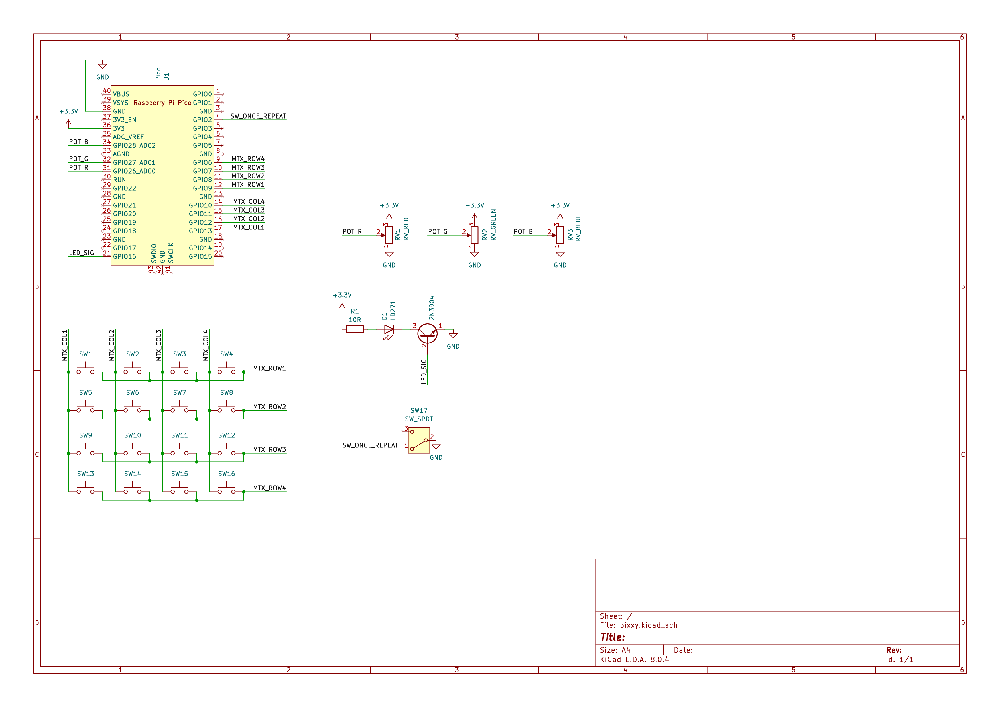

# Pixxy

Pixxy is a physical remote control for PixMob bracelets using a custom PCB, based on a Raspberry Pi Pico and
MicroPython. The PCB design is available in the [pixxy-kicad](pixxy-kicad) folder. I used KiCad 8 to design this PCB.

## Branches
- [main](/wouterdedroog/pixxy/tree/main) - Full project details and PCB design based on the RP2040 chip
- [pico](/wouterdedroog/pixxy/tree/pico) - PCB design based on the Raspberry Pi Pico
- [src](/wouterdedroog/pixxy/tree/src) - MicroPython source, compatible with both variations of Pixxy device

## Schematic of Pico-based version
The PCB and schematic were made using KiCad 8. The project files are available in the
[pixxy-kicad directory](pixxy-kicad). A screenshot of the schematic can be found below:

